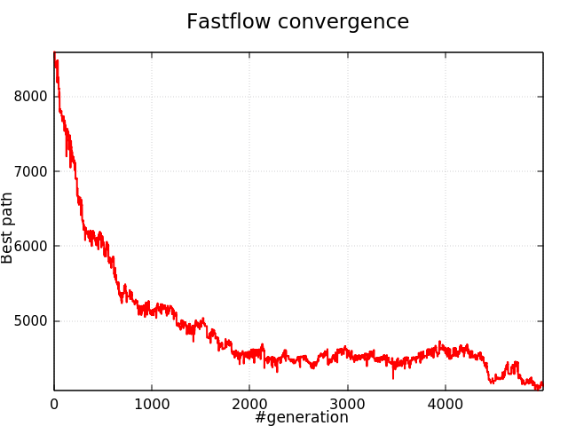
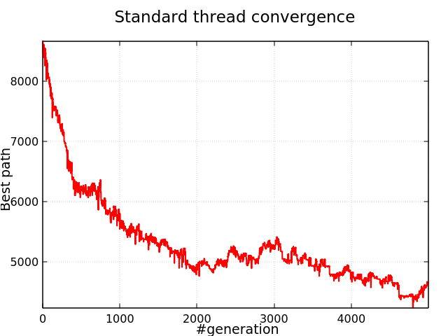
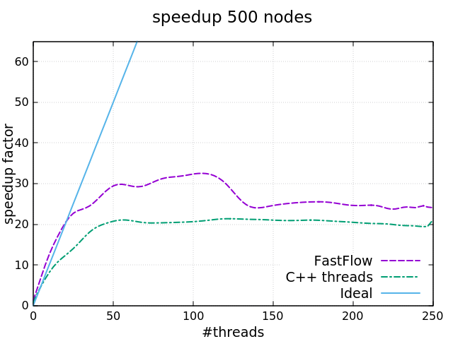

# TSP with Genetic Algorithms
The purpose of the project was to solve [Travelling Salesman Problem](https://en.wikipedia.org/wiki/Travelling_salesman_problem), known as *TSP*, by using a [Genetic Algorithms](https://ibug.doc.ic.ac.uk/media/uploads/documents/courses/GeneticAlgorithm-tutorial.pdf) approach. In addition to the sequential version used as a baseline, two parallel versions were developed, one using standard C++ threads and one using [Fastflow](https://github.com/fastflow/fastflow#fastflow-high-performance-parallel-patterns-and-building-blocks-in-c). More information about the project and the design of the parallel versions can be found in the [report](https://github.com/FraCorti/TSP-GeneticAlgorithm/blob/master/GeneticTSP/report.pdf).

To test the correctness of the three versions developed, I saved for a run of each version the current best route for each generation of the algorithm. In the following plots the length of the best path decrease as the algorithm goes on with the generation, so convergence algorithms were obtained. 


  


## Running the project
The project can be compiled and executed using [Cmake 3.11](https://cmake.org/) or [GCC](https://gcc.gnu.org/) (remember to turn on -O3 optimization). 

If CMake is installed type:
`mkdir build && cd build `

Then (if you want to use Debug build type add `-DCMAKE_BUILD_TYPE=Debug` at the end) type: `cmake ..`

Now to build the project type: 
`cmake --build .` 

Otherwise, to use GCC use: 

`g++ -std=c++17 -O3 main.cpp -o GeneticTSP -pthread `

To run the program correctly, you need to pass to the executable the following parameters: 

```./GeneticTSP nodesNumber chromosomesNumber generationNumber mutationRate crossoverRate workersNumber [seed]```


## Results 
Each version of the program was tested on an Intel Xeon PHI machine from 1 to 256 thread. The tests were done with 10 generation and 20000 chromosomes and considering [500, 1000, 2000] nodes in the graph. The following speedup curves were obtained:<br/><br/>
 
 <br/>

<br/>



## Acknowledgments
This project was developed for the course of [Parallel and Distributed Systems](http://didawiki.di.unipi.it/doku.php/magistraleinformaticanetworking/spm/sdpm09support) at the University of Pisa under the guide of [Prof. Marco Danelutto](http://calvados.di.unipi.it/paragroup/danelutto/) and [Prof. Massimo Torquati](http://calvados.di.unipi.it/paragroup/torquati/).